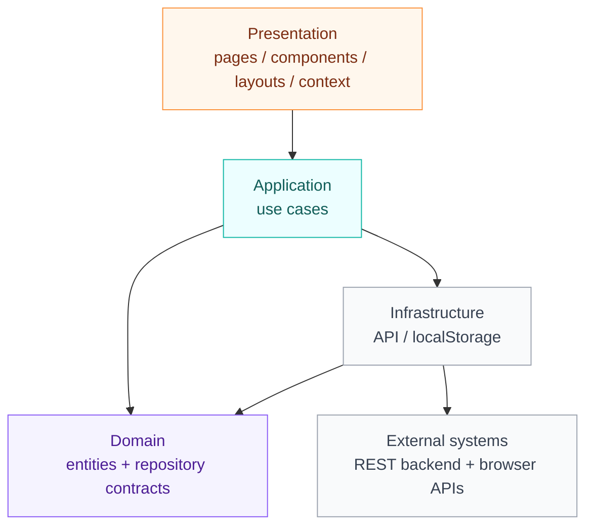

# YaayDoom - Frontend

Interface web de YaayDoom, une plateforme de suivi maternel et infantile.  
Ce dépôt contient uniquement le front React/Vite. Le backend Laravel est séparé dans `Backend-Yaaydoom/` et expose l’API consommée par cette application.

## Présentation

Le front permet à trois profils d’utiliser la plateforme:

- `maman` pour suivre la grossesse, le bébé, la carte et les rendez-vous
- `professionnel` pour consulter les dossiers, gérer les grossesses, les consultations, les vaccins et les scans
- `admin` pour superviser les comptes, valider les professionnels et consulter les statistiques

L’application s’appuie sur:

- React 19
- Vite
- React Router
- Axios
- i18next
- Tailwind CSS
- Docker pour les environnements local et de prévisualisation

## Fonctionnalités

### Accès et authentification

- page d’accueil
- connexion
- inscription
- déconnexion
- persistance de session via `localStorage`
- redirection automatique selon le rôle

### Espace maman

- tableau de bord maman
- création et suivi de grossesse
- consultation du bébé
- consultation de la carte de santé
- consultation du calendrier vaccinal
- gestion des rendez-vous

### Espace professionnel

- tableau de bord professionnel
- liste des grossesses
- consultations
- vaccinations
- scan patient
- consultation d’un dossier familial

### Espace admin

- tableau de bord admin
- gestion des utilisateurs
- validation des professionnels
- statistiques globales

## Architecture

Le front suit maintenant une **Clean Architecture pure** côté code applicatif:

- `src/presentation/` est représenté ici par `src/pages/`, `src/components/`, `src/layouts/` et `src/context/`
- `src/application/` contient les use cases
- `src/domain/` contient les types métier et les contrats de repository
- `src/infrastructure/` contient les implémentations concrètes pour l’API et le stockage local
- `src/core/` conserve les briques transverses partagées
- `src/i18n/` gère l’internationalisation

Le runtime applique ce flux:



## Arborescence utile

```text
src/
  application/
  components/
  context/
  core/
  domain/
  i18n/
  infrastructure/
  layouts/
  pages/
  router/
```

## Routes principales

| Route | Description |
| --- | --- |
| `/` | Page d’accueil |
| `/login` | Connexion |
| `/register` | Inscription |
| `/dashboard-maman` | Tableau de bord maman |
| `/dashboard-maman/bebe` | Dossier bébé |
| `/dashboard-maman/vaccination` | Vaccinations |
| `/dashboard-maman/carte` | Carte de santé |
| `/dashboard-maman/grossesse` | Grossesse |
| `/dashboard-maman/rendez-vous` | Rendez-vous |
| `/dashboard-pro` | Tableau de bord professionnel |
| `/dashboard-pro/consultations` | Consultations |
| `/dashboard-pro/grossesses` | Grossesses |
| `/dashboard-pro/vaccinations` | Vaccinations |
| `/dashboard-pro/scan` | Scan patient |
| `/famille/:id` | Dossier familial |
| `/dashboard-admin` | Tableau de bord admin |
| `/admin/validation` | Validation des professionnels |
| `/admin/utilisateurs` | Gestion des utilisateurs |
| `/admin/statistiques` | Statistiques |

## API et authentification

Le front appelle le backend via Axios dans `src/core/api/api.js`, tandis que les use cases vivent dans `src/application/`.

Points importants:

- le token est stocké dans `localStorage` sous `yaydoom_token`
- l’utilisateur est stocké dans `localStorage` sous `yaydoom_user`
- les requêtes ajoutent automatiquement le header `Authorization: Bearer <token>`
- en cas de `401`, l’application nettoie la session et renvoie vers `/login`
- les pages de login et d’inscription passent par `src/application/auth`
- `AuthContext` orchestre uniquement la session UI et la navigation

Le backend attendu expose les routes sous `VITE_API_BASE_URL`, par défaut:

```env
VITE_API_BASE_URL=https://yaaydoom-backend-latest.onrender.com/api
```

## Variables d’environnement

Copie le fichier `.env.example` en `.env` si besoin, puis ajuste les valeurs.

Variables disponibles:

```env
VITE_API_BASE_URL=https://yaaydoom-backend-latest.onrender.com/api
VITE_PASSPORT_CLIENT_ID=your_client_id
VITE_PASSPORT_CLIENT_SECRET=your_client_secret
```

### Variables utiles pour le build

Le projet Vite utilise aussi:

- `BASE_PATH` pour modifier le chemin racine du site
- `IS_PREVIEW` pour le mode prévisualisation

Exemple:

```bash
BASE_PATH=/ VITE_API_BASE_URL=https://api.example.com/api npm run build
```

## Prérequis

- Node.js 20 ou supérieur
- npm
- le backend Laravel accessible

## Installation

```bash
npm install
```

## Lancement en local

### Mode développement

```bash
npm run dev
```

Le serveur Vite démarre sur:

- `http://localhost:3000`

### Vérification TypeScript

```bash
npm run type-check
```

### Lint

```bash
npm run lint
```

### Build de production

```bash
npm run build
```

Le build est généré dans le dossier:

- `out/`

### Prévisualisation du build

```bash
npm run preview
```

## Docker

Le front contient aussi sa configuration Docker pour le local et la prévisualisation:

- [Dockerfile](/home/boombaye/Documents/YaayDoom+/project-yaaydoom+/Dockerfile)
- [Dockerfile.dev](/home/boombaye/Documents/YaayDoom+/project-yaaydoom+/Dockerfile.dev)
- [docker-compose.yml](/home/boombaye/Documents/YaayDoom+/project-yaaydoom+/docker-compose.yml)
- [docker-compose.dev.yml](/home/boombaye/Documents/YaayDoom+/project-yaaydoom+/docker-compose.dev.yml)

### Production Docker

```bash
docker compose -f docker-compose.yml up -d --build
```

### Développement Docker

```bash
docker compose -f docker-compose.dev.yml up -d --build
```

## Déploiement

### Vercel

Pour déployer le front sur Vercel:

- laisser le build Vite générer `out/` via `npm run build`
- définir `VITE_API_BASE_URL` avec l’URL publique de ton backend Laravel
- vérifier que le backend autorise le domaine Vercel dans le CORS
- garder les rewrites SPA de `vercel.json` pour que React Router fonctionne sur les routes profondes

Le front peut rester en Docker pour le développement local, mais le déploiement Vercel utilise le build Vite.

## Comportement applicatif

### Authentification

Le flux de connexion est géré par `src/application/auth`, `src/infrastructure/auth/localAuthRepository.ts` et `src/context/AuthContext.tsx`.

### Redirection par rôle

- `maman` -> `/dashboard-maman`
- `professionnel` -> `/dashboard-pro` si le compte est validé
- `admin` -> `/dashboard-admin`

### Protection des pages

Les routes sensibles passent par `ProtectedRoute`.

### Données locales

Les données applicatives viennent du backend Laravel via l’URL configurée dans `VITE_API_BASE_URL`.

## Configuration i18n

L’application charge i18n dès le démarrage dans `src/main.tsx`.  
Le système est prêt pour l’internationalisation si tu veux ajouter d’autres langues plus tard.

## Notes de maintenance

- Le code legacy `src/features/*/services` et les anciens écrans `src/features/*/pages` ont été supprimés.
- La structure cible est désormais `domain / application / infrastructure / presentation`.
- Les scripts `type-check` et `lint` restent les meilleurs garde-fous avant toute nouvelle migration.
- Les API doivent rester alignées avec le backend Laravel dans `Backend-Yaaydoom/`.
- Si tu changes le backend, pense à mettre à jour `VITE_API_BASE_URL`.

## Licence

Projet interne YaayDoom.
