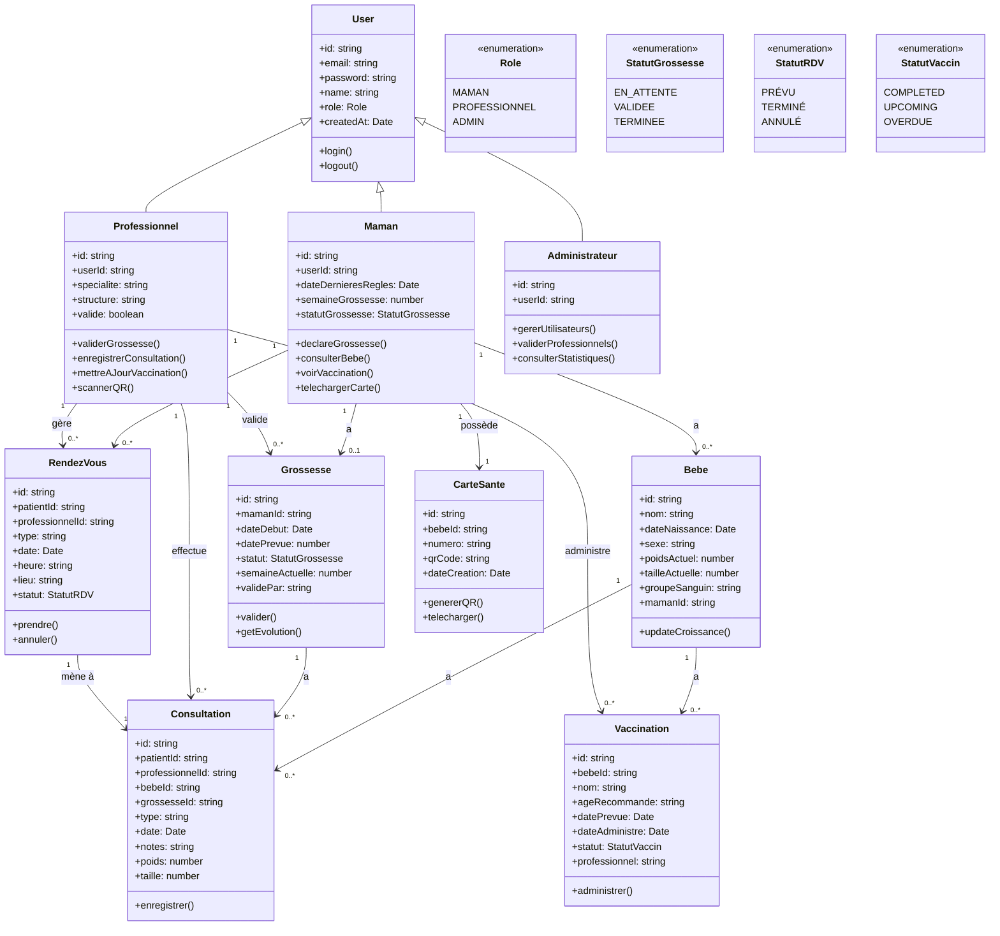
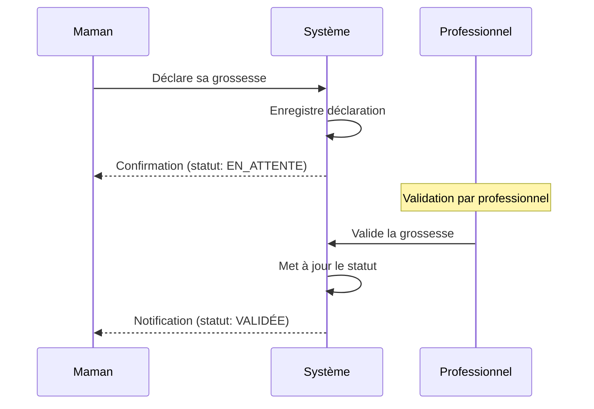
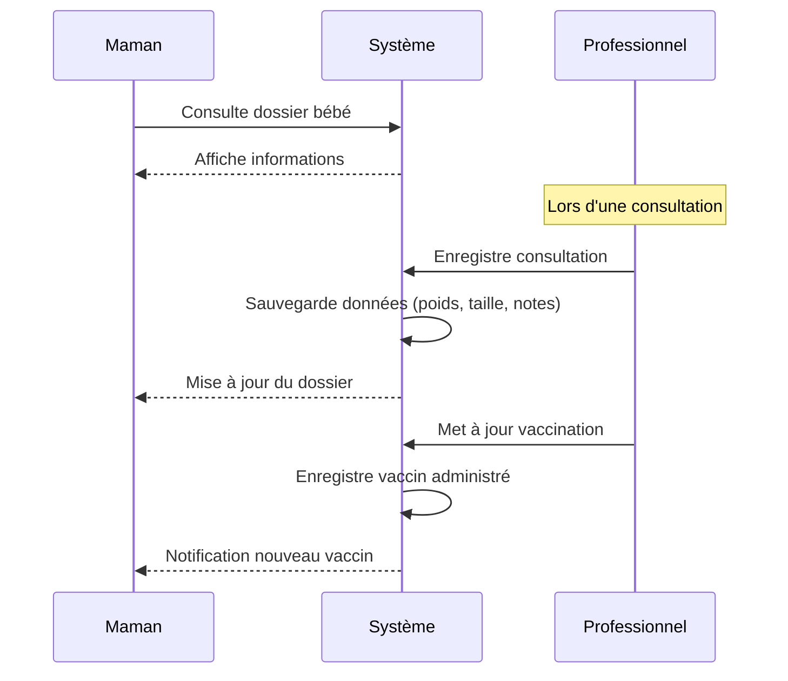
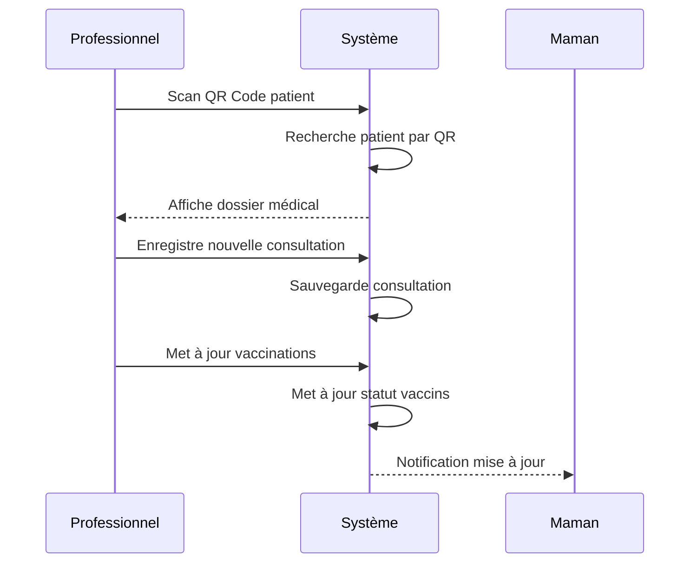
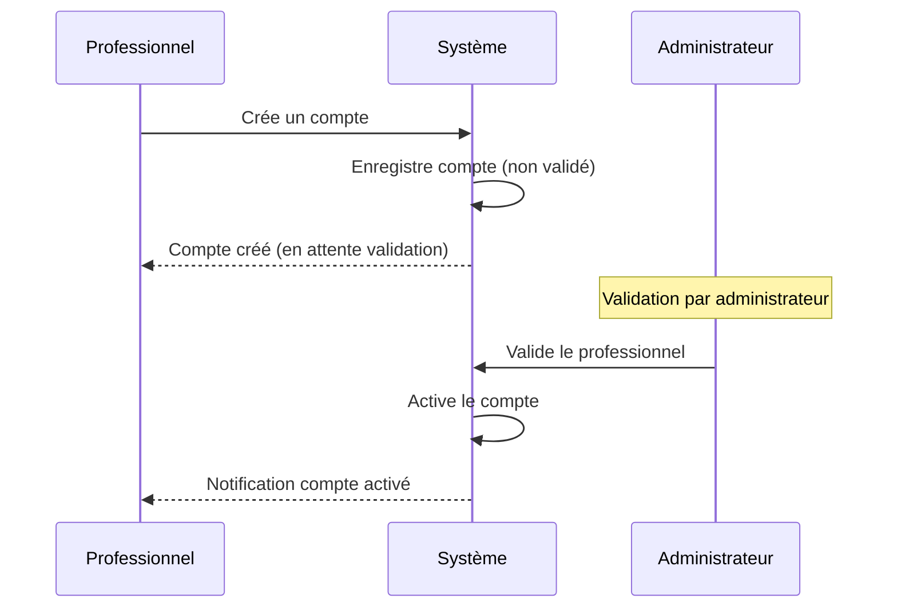
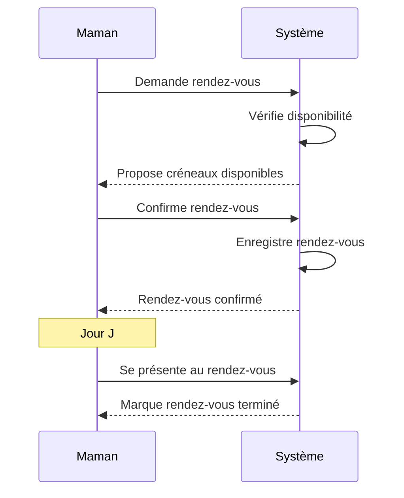

# Diagrammes UML - YaayDoom+

## 1. Diagramme des Cas d'Utilisation (Use Case Diagram)

```mermaid
graph TB
    subgraph Acteurs
        M["👩 Maman"]
        P["👨‍⚕️ Professionnel"]
        A["⚙️ Administrateur"]
    end

    subgraph Cas d'Utilisation Maman
        M1["S'inscrire / Se connecter"]
        M2["Déclarer grossesse"]
        M3["Suivre ma grossesse"]
        M4["Consulter dossier bébé"]
        M5["Voir calendrier vaccinal"]
        M6["Télécharger carte QR"]
        M7["Prendre rendez-vous"]
        M8["Consulter historique médical"]
    end

    subgraph Cas d'Utilisation Professionnel
        P1["Se connecter"]
        P2["Valider grossesses"]
        P3["Enregistrer consultations"]
        P4["Mettre à jour vaccinations"]
        P5["Scanner QR code patient"]
        P6["Consulter dossiers patients"]
        P7["Gérer rendez-vous"]
    end

    subgraph Cas d'Utilisation Administrateur
        A1["Se connecter"]
        A2["Gérer utilisateurs"]
        A3["Valider professionnels"]
        A4["Consulter statistiques"]
        A5["Valider déclarations"]
    end

    M --> M1
    M --> M2
    M --> M3
    M --> M4
    M --> M5
    M --> M6
    M --> M7
    M --> M8

    P --> P1
    P --> P2
    P --> P3
    P --> P4
    P --> P5
    P --> P6
    P --> P7

    A --> A1
    A --> A2
    A --> A3
    A --> A4
    A --> A5
```

## 2. Diagramme de Classes (Class Diagram)

## 3. Diagrammes de Séquence

### 3.1 Déclaration de Grossesse

### 3.2 Consultation de Bébé

### 3.3 Scan QR Code par Professionnel

### 3.4 Création de Compte Professionnel

### 3.5 Prise de Rendez-vous

## 4. Résumé des Acteurs et Cas d'Utilisation

| Acteur | Cas d'utilisation principaux |
|--------|----------------------------|
| **Maman** | S'inscrire, Se connecter, Déclarer grossesse, Suivre grossesse, Consulter dossier bébé, Voir vaccinations, Télécharger carte QR, Prendre rendez-vous |
| **Professionnel** | Se connecter, Valider grossesses, Enregistrer consultations, Mettre à jour vaccinations, Scanner QR, Consulter dossiers, Gérer rendez-vous |
| **Administrateur** | Se connecter, Gérer utilisateurs, Valider professionnels, Consulter statistiques, Valider déclarations |
